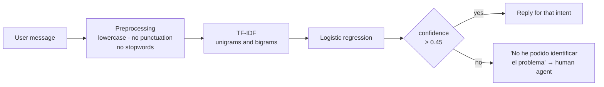

# ChatBot-Support — Technical support issue classifier

First-line chatbot for a support desk: it reads what the user writes, decides what kind
of issue it is and answers with the usual steps for that case. If it is not sure, it says
so and hands off to a human agent instead of making up an answer.

Project from the **Specialization Course in Artificial Intelligence and Big Data**.

## How it works



It recognizes seven intents, named in Spanish in the code: **conexión** (connection),
**contraseña** (password), **correo** (email), **rendimiento** (performance),
**impresora** (printer), **saludo** (greeting) and **despedida** (goodbye). Everything
else falls into *desconocido* (unknown).

## Technical decisions

- **Confidence threshold.** A classifier always returns *some* class, even when the text
  looks like nothing it has seen. So the code reads `predict_proba` and, below 0.45, it
  answers that it did not understand. Better that than a wrong answer given confidently.
- **Bigrams in the TF-IDF.** "no funciona" and "no llegan" change meaning depending on the
  word that comes next; unigrams alone lose that.
- **Hand-written Spanish stopwords.** scikit-learn ships no list for Spanish, so this uses
  a short one written by hand. One-letter words are dropped too.
- **An honest evaluation before serving.** It runs a stratified 25% *train/test split* and
  prints the `classification_report`; then it retrains on everything so the model that
  answers uses all the phrases.

## Files

| File | What it does |
|---|---|
| `chatbot_support.py` | Training data, pipeline, threshold and console chat |
| `support_api.py` | FastAPI with CORS: `/chat`, `/history`, `/evaluation`, `/health` |

## Running it

```bash
pip install -r requirements.txt

# Console chat
python chatbot_support.py

# API
uvicorn support_api:app --reload
```

```bash
curl -X POST http://127.0.0.1:8000/chat \
  -H "Content-Type: application/json" \
  -d '{"message": "no me llegan los correos desde esta mañana"}'
```

## Scope

The training set is about fifty Spanish phrases written by hand, enough to show the
pipeline and the confidence threshold, not enough for production. To grow it, just add
`(phrase, intent)` pairs to `TRAINING_DATA`.

## Stack

Python · scikit-learn (TF-IDF, LogisticRegression) · FastAPI
