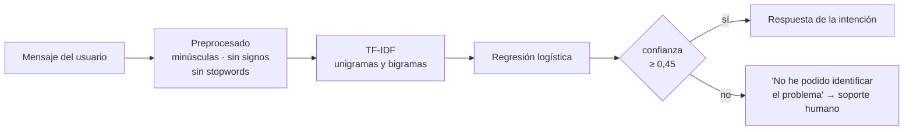

# ChatBot-Soporte — Clasificador de incidencias de soporte técnico

Chatbot de primer nivel para un servicio de soporte: lee lo que escribe el usuario,
decide de qué tipo de incidencia se trata y responde con los pasos habituales para
ese caso. Si no está seguro, lo dice y deriva a soporte humano en vez de inventarse
una respuesta.

Proyecto del **Curso de Especialización en Inteligencia Artificial y Big Data**.

## Cómo funciona



Reconoce siete intenciones: **conexión**, **contraseña**, **correo**, **rendimiento**,
**impresora**, **saludo** y **despedida**. Todo lo demás cae en *desconocido*.

## Decisiones técnicas

- **Umbral de confianza.** Un clasificador siempre devuelve *alguna* clase, aunque el
  texto no se parezca a nada. Por eso se mira `predict_proba` y, por debajo de 0,45, se
  responde que no se ha entendido. Es preferible a dar una respuesta equivocada con
  seguridad.
- **Bigramas en el TF-IDF.** "no funciona" y "no llegan" cambian de significado según
  la palabra que va después; con unigramas solos se pierde.
- **Stopwords propias en español.** scikit-learn no trae lista para español, así que se
  usa una lista corta hecha a mano. Se dejan fuera palabras de una letra.
- **Evaluación honesta antes de servir.** Se hace un *train/test split* estratificado
  al 25 % y se imprime el `classification_report`; después se reentrena con todo para
  que el modelo que responde use todas las frases.

## Ficheros

| Fichero | Qué hace |
|---|---|
| `chatbot_support.py` | Datos de entrenamiento, pipeline, umbral y chat por consola |
| `support_api.py` | FastAPI con CORS: `/chat`, `/history`, `/evaluation`, `/health` |

## Ejecución

```bash
pip install -r requirements.txt

# Chat por consola
python chatbot_support.py

# API
uvicorn support_api:app --reload
```

```bash
curl -X POST http://127.0.0.1:8000/chat \
  -H "Content-Type: application/json" \
  -d '{"message": "no me llegan los correos desde esta mañana"}'
```

## Alcance

El conjunto de entrenamiento son unas cincuenta frases escritas a mano, suficientes
para demostrar el pipeline y el umbral de confianza, no para producción. Para
ampliarlo, basta con añadir pares `(frase, intención)` a `TRAINING_DATA`.

## Stack

Python · scikit-learn (TF-IDF, LogisticRegression) · FastAPI
